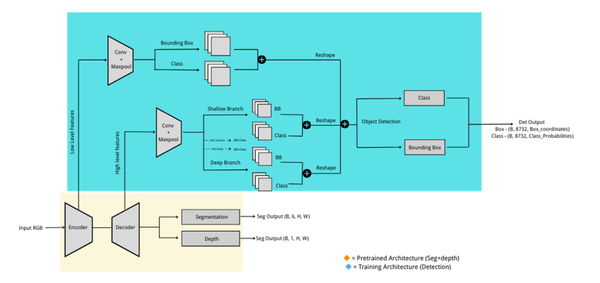

# HydraNet: Multi-Task Perception for Autonomous Vehicles

Unified perception model performing simultaneous object detection, semantic segmentation, and depth estimation for autonomous driving.

## Overview

Implementation of a multi-task learning architecture that performs three critical perception tasks concurrently using a shared MobileNetV2 encoder with task-specific decoders. The model integrates YOLOv8 and SSD detection heads while maintaining segmentation and depth estimation accuracy.

## Demo

### Multi-Task Inference Results

| YOLOv8 + Seg + Depth | SSD + Seg + Depth |
|----------------------|-------------------|
|  |  |
| *YOLOv8 variant: Tighter bounding boxes, 72.1% mAP* | *SSD variant: Lower memory usage, 40.9% mAP* |

### Architecture 

<div align="center">

</div>

*Multi-task architecture with shared MobileNetV2 encoder and task-specific decoders. Orange: Pretrained seg+depth, Blue: Detection head training*

## Key Features

- **Unified Architecture**: Single encoder for three perception tasks reducing computational redundancy
- **Dual Detection Heads**: Interchangeable YOLOv8 and SSD implementations for flexibility
- **Real-time Performance**: Optimized for edge GPU deployment (40+ FPS on Jetson)
- **Knowledge Distillation**: Teacher-student framework for improved multi-task learning
- **Dynamic Loss Balancing**: Uncertainty-based weighting prevents task dominance

## Performance Metrics

### Standalone Baselines
| Task | Metric | Value |
|------|--------|-------|
| Segmentation | mIoU | 86.1% |
| Depth | RMSE | 3.659m |
| YOLOv8 Detection | mAP@0.5 | 72.8% |
| SSD Detection | mAP@0.5 | 48.35% |

### Multi-Task Results (YOLOv8 Head)
| Task | Metric | Value | Retention |
|------|--------|-------|-----------|
| Segmentation | mIoU | 75.4% | 87.6% |
| Depth | RMSE | 3.89m | 94.0% |
| Detection | mAP@0.5 | 72.1% | 99.0% |

### Multi-Task Results (SSD Head)
| Task | Metric | Value | Retention |
|------|--------|-------|-----------|
| Segmentation | mIoU | 68.2% | 79.2% |
| Depth | RMSE | 4.56m | 75.3% |
| Detection | mAP@0.5 | 40.9% | 84.6% |

## Technical Stack

- **Framework**: PyTorch 2.0
- **Encoder**: MobileNetV2 (pretrained, shared)
- **Decoders**: Light-Weight RefineNet (seg/depth), YOLOv8/SSD (detection)
- **Datasets**: KITTI Vision Benchmark + BDD100K
- **Optimization**: AdamW with OneCycleLR, mixed precision (AMP)

## Installation

Clone and setup:

    git clone https://github.com/ritwikrohan/HydraNet.git
    cd HydraNet
    
    pip install torch torchvision --index-url https://download.pytorch.org/whl/cu118
    pip install -r requirements.txt

Download pretrained weights:

    python download_weights.py

## Usage

Run multi-task inference:

    # YOLOv8 variant
    python inference.py --model yolo --input path/to/image
    
    # SSD variant  
    python inference.py --model ssd --input path/to/image

Train detection head (frozen encoder):

    python train_detection.py --head yolo --epochs 100

Evaluate on KITTI:

    python evaluate.py --split val --tasks all

## Repository Structure

```
HydraNet/
├── models/
│   ├── encoder/             # MobileNetV2 backbone
│   ├── decoders/           # RefineNet for seg/depth
│   ├── detection/          # YOLOv8 and SSD heads
│   └── hydranet.py         # Unified model
├── datasets/
│   ├── kitti.py           # KITTI dataloader
│   └── bdd100k.py         # BDD100K dataloader
├── utils/
│   ├── loss.py            # Multi-task loss functions
│   ├── metrics.py         # Evaluation metrics
│   └── postprocess.py     # NMS, decoding
└── configs/               # Training configs
```

## Technical Implementation

### Architecture Overview
The model uses a shared MobileNetV2 encoder that branches into three task-specific decoders:
- **Segmentation/Depth**: Light-Weight RefineNet with multi-resolution fusion
- **Detection (YOLOv8)**: Features from L3, L5, L7 → CRP blocks → decoupled heads
- **Detection (SSD)**: 6 feature maps → 8,732 anchors → MultiBox predictions

### YOLOv8 Detection Head
- Extracts features at 3 scales from RefineNet (24×80, 12×40, 6×20)
- CRP blocks for context aggregation
- Decoupled classification and regression branches
- Distribution Focal Loss (DFL) + CIoU + BCE losses

### SSD Detection Head  
- 6 feature pyramid levels from encoder/decoder
- 8,732 default anchors with varied aspect ratios
- Smooth L1 (localization) + Softmax CE (classification)
- Lower memory usage, suitable for embedded systems

### Loss Functions
```
Total Loss = λ₁·L_seg + λ₂·L_depth + λ₃·L_det

Where:
- L_seg: Cross Entropy (ignore_index=255)
- L_depth: BerHu loss for robust depth regression
- L_det: CIoU+DFL+BCE (YOLO) or MultiBox (SSD)
- λᵢ: Learned uncertainty weights
```

### Training Strategy
1. **Stage 1**: Load pretrained seg+depth model (Nekrasov et al.)
2. **Stage 2**: Freeze encoder/seg/depth, train detection head only
3. **Knowledge Distillation**: Use teacher models for pseudo-labels
4. **Mixed Precision**: AMP for faster training and reduced memory

## Results

- **YOLOv8 variant** maintains 99% detection accuracy while preserving 87.6% segmentation performance
- **SSD variant** offers 35% lower GPU memory usage with acceptable accuracy trade-off
- Both achieve real-time inference (>30 FPS) on NVIDIA Jetson platforms
- Qualitative results show good alignment between detected objects and segmented regions

## Citation

```bibtex
@article{hydranet2025,
  title={Multi-Task Perception Model for Autonomous Vehicles},
  author={Rohan, Ritwik and Lê, Minh and Lu, Yi and Yong, Yuhan},
  journal={EN.601.661 Computer Vision},
  year={2025}
}
```

## Contact

**Ritwik Rohan**  
Robotics Engineer | Johns Hopkins MSE '25  
Email: ritwikrohan7@gmail.com  
LinkedIn: [linkedin.com/in/ritwik-rohan](https://linkedin.com/in/ritwik-rohan)

---
